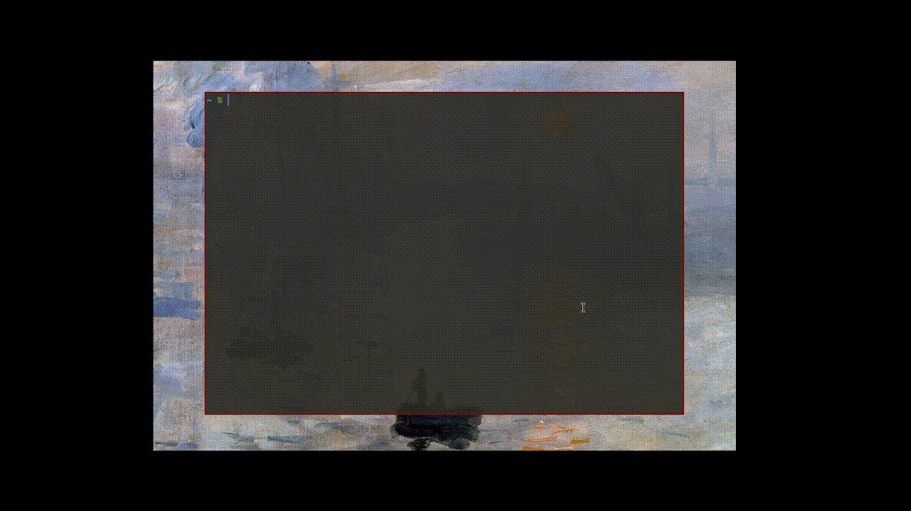

[](https://choosealicense.com/licenses/mit/)


*bkekw is (an ugly, even uglier than [b](https://github.com/LeBaronDeCharlus/b)), tool that allows you to copy your Bitwarden/Vaultwarden password directly from your terminal.*

### Why?

It works for me. You run it in a shell session. The first time, it will prompt you for the master password, but consecutive times that you run `b` within the session, the vault will already be unlocked. I use it on a dwm st scratchpad, by the way.

### Demo



### Dependencies

- `bw`
- `xclip`
- `jq`
- `fzf`

### Installation

Move the `b` file to `~/.local/bin`.

```shell
mv b ~/.local/bin
```

Create the alias to run the program from the current context:
```shell
alias b=". ~/.local/bin/bkekw"
```

### Usage
Search for a password :
```shell
# ex, search github password
b github
```

